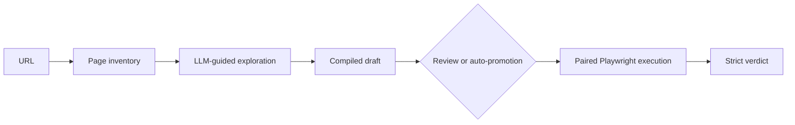

# Metamorph

Metamorph is a research prototype for discovering and replaying metamorphic tests on arbitrary web interfaces. Given a user-supplied URL, it explores the rendered page, proposes candidate relations with bounded LLM assistance, compiles them into Playwright playbooks, and evaluates their source and follow-up executions with a strict deterministic verdict.

## The problem

End-to-end web tests often face the oracle problem: the expected result of one execution is difficult to define in advance. Dynamic content, asynchronous rendering, and changing layouts make fixed assertions costly and brittle.

Metamorphic testing addresses this problem by checking a relation between two executions instead of checking one absolute output. A metamorphic relation defines a source interaction, a transformed follow-up interaction, and an expected relation between their observations. For example, adding a restrictive filter should not increase the reported number of results.

Metamorph applies four relation families during discovery:

| Family | Expected relation |
| --- | --- |
| Idempotence | Repeating an action preserves the observable outcome. |
| Subset | Adding a restriction does not increase the result set. |
| Permutation | Reordering independent actions preserves the final state. |
| Inverse | Applying an action and undoing it restores the previous state. |

The LLM is used only during bounded exploration. Once a relation has been compiled and approved, replay executes fixed Playwright steps and evaluates predefined observations without further LLM inference.

## Workflow



The browser worker builds a Set of Marks inventory that labels interactable page elements as `E1`, `E2`, and so on. The exploration worker uses that grounded inventory to propose and validate actions. Drafts can be reviewed in the web interface before promotion, while auto mode executes successful drafts immediately. Screenshots, Playwright traces, observations, and verdicts remain linked to the session for later triage.

## Workspace

The monorepo separates deployable applications from shared packages so that browser automation, LLM exploration, and deterministic replay use the same contracts and metamorphic semantics.

| Module | Kind | Responsibility |
| --- | --- | --- |
| `@metamorph/web` | App | Human-in-the-loop interface for sessions, live activity, review, and run triage. |
| `@metamorph/api` | App | REST API, job orchestration, artifact URLs, and server-sent events. |
| `@metamorph/worker-playwright` | App | Page inventory capture, exploration probes, and paired browser execution. |
| `@metamorph/worker-llm` | App | LangGraph-based exploration and draft-compilation orchestration. |
| `@metamorph/core` | Package | Shared MR schemas, relation engine, compiler, and Playwright playbook templates. |
| `@metamorph/inventory` | Package | Set of Marks inventory capture over Playwright. |
| `@metamorph/mr-promotion` | Package | Approval, auto-promotion, and execution-enqueueing use cases. |
| `@metamorph/contracts` | Package | Validated RabbitMQ messages and routing keys. |
| `@metamorph/api-client` | Package | Typed HTTP client and SSE helpers shared with the web app. |
| `@metamorph/session-control` | Package | Cooperative pause and resume signals across workers. |
| `@metamorph/utils` | Package | Shared domain and infrastructure utilities. |

PostgreSQL stores lifecycle state, MinIO stores screenshots and traces, and RabbitMQ connects the API with both worker types.

## Run locally
### Prerequisites

- Node.js 22.13 or newer
- pnpm 11.5 or newer
- Docker Compose v2
- An OpenRouter API key for LLM-assisted exploration

Create a local environment file, install dependencies, and start the infrastructure:

```bash
cp .env.example .env
pnpm install
```
Set `OPENROUTER_API_KEY` in `.env`, then start the workers in Docker:

```bash
docker compose up -d
```

Generate the database schema:

```bash
pnpm db:migrate
pnpm db:generate
```

Run the API and web application:

```bash
pnpm dev
```


Open [http://localhost:3000](http://localhost:3000), create a session with a public URL, choose the relation families and either review mode or auto mode. The API health endpoint is available at [http://localhost:3001/health](http://localhost:3001/health).

## Validation

The thesis validation protocol defines a case study on Amazon, Booking, Airbnb, MediaMarkt, and GitHub. It uses 25 sessions across the five domains and explores all four relation families, yielding 100 discovery attempts. The evaluation measures:

| Research question | Evidence |
| --- | --- |
| RQ1 | Exploration and compilation success, failure causes, cost, and time to draft. |
| RQ2 | LLM-free replay completion, execution time, and stable verdict and observation extraction. |
| RQ3 | Strict verdicts, observable failures, manual triage, and relation quality. |

With the stack, API, and workers running, execute a single validation session and then extract its results:

```bash
pnpm validation:batch -- --domain github --generation 1
pnpm validation:metrics
pnpm validation:replay
pnpm validation:summary
```

Use `pnpm validation:batch -- --all` for the complete study. The scripts write their manifest, metric exports, review CSV files, and Markdown summary to `scripts/validation/out/`.

## Notes

This project was carried out as part of the Master's Thesis at the University of Murcia, within the Master's program in Software Engineering.